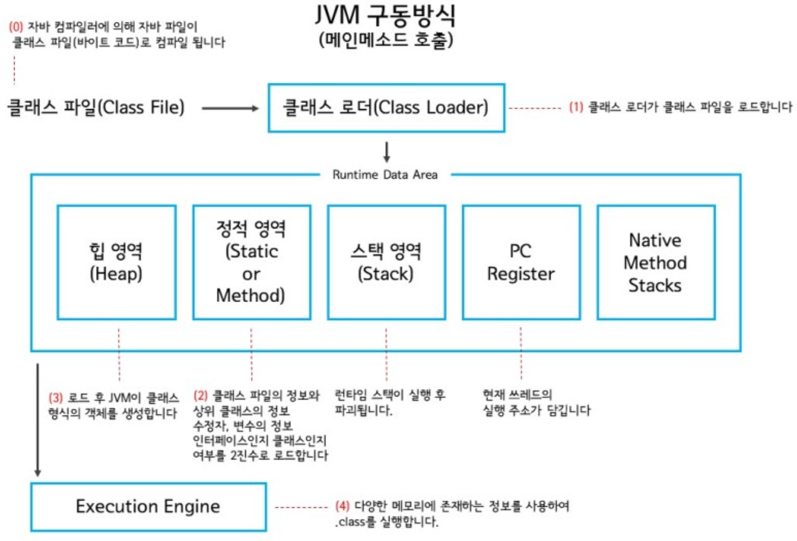

# Java-JVM

## JVM 구동방식

## Java의 메모리구조

### Heap 영역
- new를 통해 생성한 객체의 정보 (참조값 : Reference Type)
- 스레드가 공유하는 영역
- 가비지컬렉터에 의해서 메모리가 관리

### Static 영역
- Method영역, 정적영역
- JVM이 동작해서 클래스가 로딩될 때 생성.
- JVM이 읽어들인 클래스와 인터페이스 대한 런타임 상수 풀, 멤버 변수(필드), 클래스 변수(Static 변수), 상수(final), 생성자(constructor)와 메소드(method) 등을 저장하는 공간
- 인스턴스를 생성하지 않아도 사용할 수 있다.
- 스레드가 공유하는 영역
- 미리 로드되어 있기에 호출시에 시간이 적게걸림
- 할당받는 메모리가 한정되어 있으며
따로 메모리 관리가 되지 않기 때문에​
남발해서 사용해선 안된다.

​
### Stack 영역
- 기본자료형(int, long, float 등)에 해당하는 지역변수가 저장
- 쓰레드가 실행
- Stack 은 후입선출 LIFO(Last-In-First-Out) 의 특성을 가지며, 스코프(Scope) 의 범위를 벗어나면 스택 메모리에서 사라진다.
- 모든 동작이 완료되면 메모리에서 사라짐

> 참고: https://inpa.tistory.com/entry/JAVA-%E2%98%95-%EA%B7%B8%EB%A6%BC%EC%9C%BC%EB%A1%9C-%EB%B3%B4%EB%8A%94-%EC%9E%90%EB%B0%94-%EC%BD%94%EB%93%9C%EC%9D%98-%EB%A9%94%EB%AA%A8%EB%A6%AC-%EC%98%81%EC%97%AD%EC%8A%A4%ED%83%9D-%ED%9E%99
